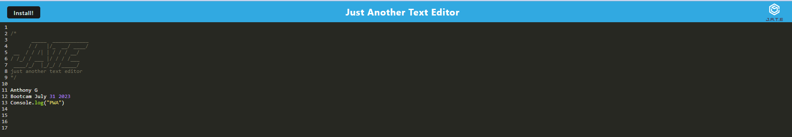

# Progressive Web Applications (PWA): Text Editor

# PWA: Text Editor

Text editor that runs in the browser. The app is a single-page application that meets the PWA criteria. Additionally, it has number of features of data persistence techniques that serve as redundancy in case one of the options is not supported by the browser. The application will also function offline.


## Text Editor for Developers

Developers can create notes or code snippets with or without an internet connection so that they can reliablily retrieve them for later use. 
This was build with the use of following NPM Packages : 
* babel/core, babel/plugin-proposal-object-rest-spread, babel/plugin-transform-runtime, babel/preset-env, babel/runtime, babel-loader.
* css-loader.
* html-webpack-plugin.
* http-server.
* style-loader.
* webpack, webpack-cli, webpack-dev-server, webpack-pwa-manifest, workbox-webpack-plugin
* code-mirror-themes (Dependencies)
* idb (Dependencies)

## User Acceptance Criteria

```md
GIVEN a text editor web application
WHEN I open my application in my editor
THEN I should see a client server folder structure
WHEN I run `npm run start` from the root directory
THEN I find that my application should start up the backend and serve the client
WHEN I run the text editor application from my terminal
THEN I find that my JavaScript files have been bundled using webpack
WHEN I run my webpack plugins
THEN I find that I have a generated HTML file, service worker, and a manifest file
WHEN I use next-gen JavaScript in my application
THEN I find that the text editor still functions in the browser without errors
WHEN I open the text editor
THEN I find that IndexedDB has immediately created a database storage
WHEN I enter content and subsequently click off of the DOM window
THEN I find that the content in the text editor has been saved with IndexedDB
WHEN I reopen the text editor after closing it
THEN I find that the content in the text editor has been retrieved from our IndexedDB
WHEN I click on the Install button
THEN I download my web application as an icon on my desktop
WHEN I load my web application
THEN I should have a registered service worker using workbox
WHEN I register a service worker
THEN I should have my static assets pre cached upon loading along with subsequent pages and static assets
WHEN I deploy to Heroku
THEN I should have proper build scripts for a webpack application
```

## Requirements to run the code and to get the outputs

- VS Code, Chrome, Mozila, IE.
- OS - MS Windows, MAC or any other OS which supports GUI browser display.

## Usage

Screen layout is available in the repository path: 




## Credits

- Lecturers: Gurneesh Singh, Laura Cole and Dani Chankhour for teaching us the modules.
- Tutor Dru Sanchez for guiding me on the module.
- ASK BCS Agents

  
## Features Links

- Application video demo URL: https://drive.google.com/file/d/1G1EFn_OWSxWFCERWACp5hybXaSG0WpgD/view
- Github Repository URL: https://github.com/anthogr45/-Progressive-Web-Applications-Text-Editor